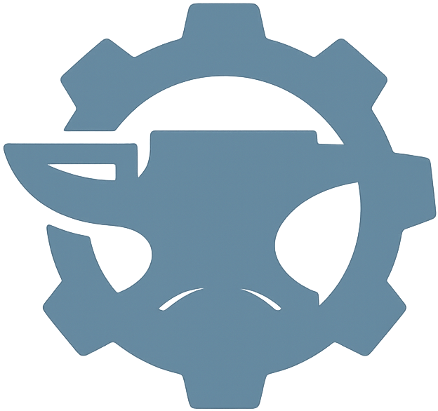
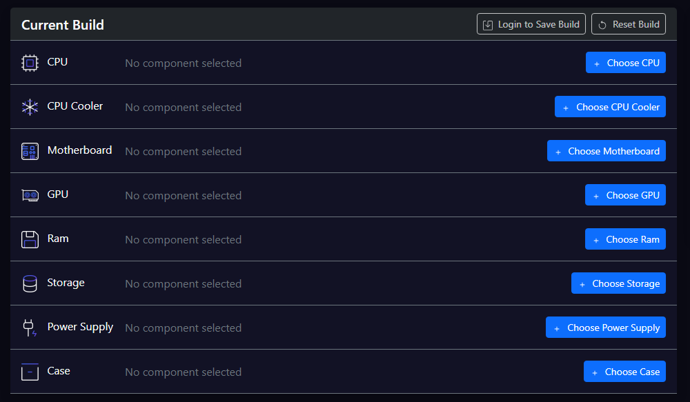

  
  <h1>RigForge Pc Builder</h1>
  
  

    RigForge is a full-stack web application that lets users assemble custom PC builds using compatible components, save and share them, and explore builds from other users. 
  

 

<!-- Table of Contents -->
# Table of Contents

- [About the Project](#about-the-project)
  * [Tech Stack](#tech-stack)
  * [Environment Variables](#environment-variables)
- [Getting Started](#getting-started)
  * [Prerequisites](#prerequisites)
- [Usage](#usage)
- [Roadmap](#roadmap)
- [Contact](#contact)
- [Acknowledgements](#acknowledgements)
  

<!-- About the Project -->
## About the Project

 
  
  
RigForge is designed for PC enthusiasts who want to experiment with custom builds, track component compatibility, and discover configurations made by the community. It features both guest and authenticated user flows, a live product catalog, and a build gallery system.

<!-- TechStack -->
### Tech Stack

  
FrontEnd

  <ul>
    <li><a href="https://react.dev/">React</a></li>
    <li><a href="https://redux-toolkit.js.org/">Redux Toolkit</a></li>
    <li><a href="https://reactrouter.com/">React Router DOM</a></li>
    <li><a href="https://getbootstrap.com/">Bootstrap & React-Bootstrap</a></li>
  </ul>

  
Backend

  <ul>
    <li><a href="https://dotnet.microsoft.com/it-it/apps/aspnet">ASP.NET Core 8 Web API</a></li>
    <li><a href="https://learn.microsoft.com/it-it/ef/core/">Entity Framework Core</a></li>
    <li><a href=https://learn.microsoft.com/it-it/aspnet/identity/overview/getting-started/introduction-to-aspnet-identity>ASP.NET Identity</a></li>
    <li><a href="https://developers.google.com/identity/protocols/oauth2?hl=it">Google OAuth 2.0</a></li>

  </ul>

Database

  <ul>
    <li><a href="https://www.microsoft.com/it-it/sql-server">SQL Server</a></li>
  </ul>

<!-- Env Variables -->
### Environment Variables

To run this project, you will need to add the following environment variables to your .env file

`VITE_GOOGLE_CLIENT_ID`

<!-- Getting Started -->
## Getting Started

To get a local copy up and running follow these simple steps.

<!-- Prerequisites -->
### Prerequisites

- [.NET 8 SDK](https://dotnet.microsoft.com/)
- [SQL Server](https://www.microsoft.com/en-us/sql-server/)
- [Node.js](https://nodejs.org/)
- [npm](https://www.npmjs.com/)

<!-- Usage -->
## Usage

Browse products by category with filtering and sorting

Create builds with compatibility validation

Save current builds (for guests) or persist them (for registered users)

Share builds via URL

View and explore community builds

Admin: Feature or delete builds from public gallery and manage everyproduct with a backoffice section

<!-- Roadmap -->
## Roadmap

Short link generation for shared builds

Improved component compatibility matrix

Direct connection with Amazon cart 

Build ratings and comments

<!-- Contact -->
## Contact

Federico Tonti  - federico.tonti@gmail.com
Discord - friedrich_3

Project Link: [https://github.com/Friedrich3/RigForgeCapstoneProject](https://github.com/Friedrich3/RigForgeCapstoneProject) 
Frontend Repository: [https://github.com/Friedrich3/RigForgeCapstoneProject/tree/main/CapstoneProject_FE/CapstoneProject](https://github.com/Friedrich3/RigForgeCapstoneProject/tree/main/CapstoneProject_FE/CapstoneProject) 
Backend Repository: [https://github.com/Friedrich3/RigForgeCapstoneProject/tree/main/CapstoneProject_BE](https://github.com/Friedrich3/RigForgeCapstoneProject/tree/main/CapstoneProject_BE) 

<!-- Acknowledgments -->
## Acknowledgements

Use this section to mention useful resources and libraries that you have used in your projects.

 - [Awesome README](https://github.com/matiassingers/awesome-readme)

